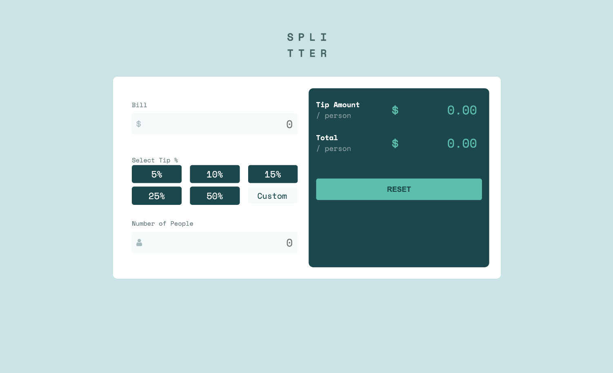

# Tip Calculator App
Created a tip calculator app called Splitter, that takes in the total bill amount, tip percentage of choice, and the number of people to split the bill amongst. That App gives the total amount to be paid by each individual and additionally display the tip amount each individual pays.

## Table of Contents
- [Overview](#overview)
- [Screenshot](#screenshot)
- [Links](#links)
- [Built With](#built-with)
- [What I Learned](#what-i-learned)
- [Acknowledgments](#acknowledgments)

 ## Overview 
Your users should be able to:
- View the optimal layout for the app depending on their device's screen size
- See hover states for all interactive elements on the page
- Calculate the correct tip and total cost of the bill per person

# Screenshot 


## Links
Solution URL: [https://github.com/Akshatasarawgi/Tip-Calculator]
Live Site URL:  [https://tipcalculator13.netlify.app]

# Learnings 
I learnt why we use !important to override the other styles applied to the element previously. 
I am still learning how to create the functions. 
I learnt how the below statements to check if all the inputs are given, in order to calculate the results.

```
if(!billAmount || !tipValue || !people) 
        return  { totalTipPerPerson: 0 , totalSplitPerPerson: 0} 
```
